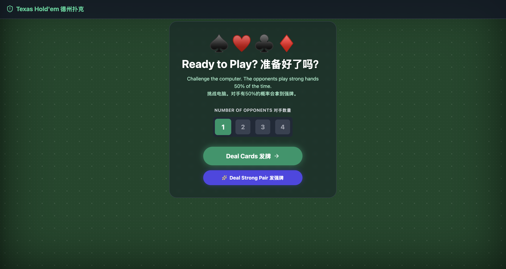
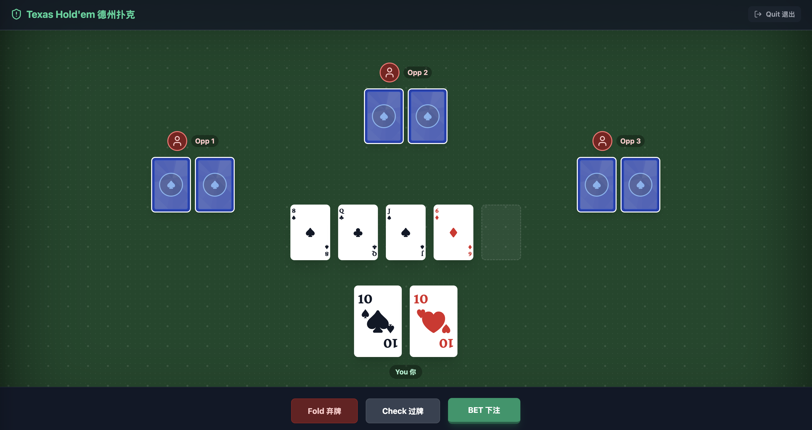
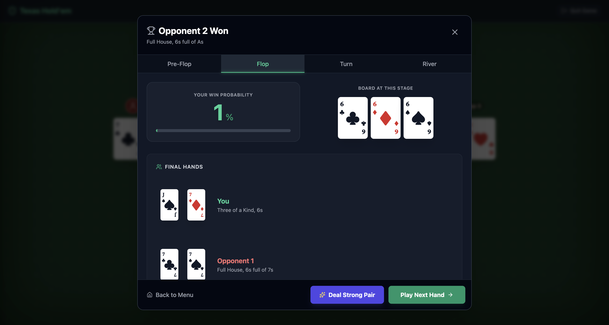

# 🃏 Texas Hold'em Simulator

A React-based Texas Hold'em poker simulator that lets you play against AI opponents and analyze your hands with detailed equity calculations at each stage of the game. It supports different device.

## Challenge 1-4 computer opponents

You can also start with a strong hands like AA, KK, QQ etc

## AI opponents play premium hands 50% of the time

## View your win probability at Pre-Flop, Flop, Turn, and River

Thanks for playing!!
